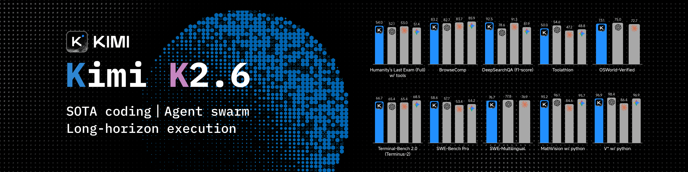

<div align="center">

**中文** | [English](README_EN.md)

# codebuddy-hud

**CodeBuddy Code 的 HUD 状态栏 — 实时展示模型、上下文、Git、工具统计、Token 用量**

兼容 CodeBuddy Code 和 Claude Code 双 transcript 格式，配色对齐 claude-hud。

[](https://www.npmjs.com/package/codebuddy-hud)
[](https://github.com/cc-claws/codebuddy-hud/stargazers)
[](LICENSE)
[](tests)

<p align="center"><code>/plugin marketplace add cc-claws/codebuddy-hud</code></p>

[为什么选 codebuddy-hud](#为什么选-codebuddy-hud) · [核心能力](#核心能力) · [安装](#安装) · [配置](#配置) · [致谢](#致谢)

</div>

## ❤️Sponsor

> [想出现在这里？](mailto:wismyzhizi2018@gmail.com)

<details open>
<summary>Click to collapse</summary>

[](https://platform.moonshot.cn/console?aff=cc-code)

Kimi K2.6 是 Moonshot AI 开源的原生多模态 Agent 模型，专为长程编程、编程驱动设计和群组任务编排而生。支持前端、DevOps、性能优化、全栈工程等复杂端到端工作流。[点击注册](https://platform.moonshot.cn/console?aff=cc-code)

---

<table>
<tr>
<td width="180"><a href="https://platform.xiaomimimo.com?ref=JBEYTF"></a></td>
<td>小米顶尖模型 MiMo V2.5，通过邀请码注册：双方各得 ¥10 API 体验金 + 首单 9 折。邀请码：JBEYTF。<a href="https://platform.xiaomimimo.com?ref=JBEYTF">点击注册</a>（注册后自动填入 · 体验金 40 天有效）</td>
</tr>

<tr>
<td width="180"><a href="https://www.bigmodel.cn/glm-coding?ic=MR7BVITFAY"></a></td>
<td>智谱 GLM Coding Plan — 国内顶流编程大模型，20+ 主流工具全适配，性价比拉满。<a href="https://www.bigmodel.cn/glm-coding?ic=MR7BVITFAY">立即参与「拼好模」</a></td>
</tr>
</table>

</details>

---

## 为什么选 codebuddy-hud？

| 对比项 | claude-hud | t-code-agent-plugins | codebuddy-hud |
|--------|-----------|---------------------|---------------|
| CodeBuddy Code 格式 | ❌ 不支持 | ❌ 不支持 | ✅ 原生支持 `function_call_result` |
| Claude Code 格式 | ✅ 支持 | ✅ 支持 | ✅ 支持 `tool_use` |
| 工具统计 | 仅最近 20 个 | 仅最近 20 个 | ✅ 整个 session 累计 |
| 启动速度 | ~0.35s | ~1.1s | ✅ ~0.2s |
| 配色对齐 claude-hud | — | ❌ | ✅ 完全对齐 |
| stdin 超时 | 250ms | 1000ms | ✅ 无超时（`for await`） |
| Git 命令 | 串行 | 串行 | ✅ 并行（`Promise.all`） |
| 缓存 | 无 | 只写不读（bug） | ✅ 读写完整 |
| 测试 | 131 通过 | 0 个测试（脚本 bug） | ✅ 131 通过 |

---

## 核心能力

| 能力 | 说明 |
|------|------|
| **双格式兼容** | 同时支持 CodeBuddy Code `function_call_result` 和 Claude Code `tool_use` transcript |
| **实时工具统计** | 整个 session 累计工具调用次数（`✓ Bash ×102 \| ✓ Read ×79 \| ...`） |
| **运行中工具** | 实时显示正在执行的工具（`◐ Bash`） |
| **Token 用量** | 会话 token 统计（`tok: 841k (in: 12k, out: 5k)`） |
| **输出速度** | 每秒输出 token 数（`out: 170.4 tok/s`） |
| **会话时长** | 会话持续时间（`⏱️ 14h 43m`） |
| **上下文进度条** | 颜色随使用率变化（green < 70% < yellow < 85% < red） |
| **Git 状态** | 分支名 + 脏标记（`git:(main*)`） |
| **全配置化** | 所有显示元素、颜色、阈值均可自定义 |
| **Compact 双行** | 第一行会话信息，第二行工具统计 |

### 效果预览

```
[hy3-preview] █░░░░░░░░░ 5% | nt_order git:(main*) | tok: 841k (in: 12k, out: 5k) | ⏱️  14h 43m | out: 166.7 tok/s
✓ Bash ×102 | ✓ Read ×79 | ✓ Edit ×56 | ✓ Grep ×4 | +4 more
```

---

## 安装

### 插件市场（推荐）

```bash
/plugin marketplace add cc-claws/codebuddy-hud
/plugin install codebuddy-hud@codebuddy-hud
```

### 手动安装

```bash
git clone https://github.com/cc-claws/codebuddy-hud.git ~/.codebuddy-hud
cd ~/.codebuddy-hud
npm install
npm run build
```

在 `~/.codebuddy/settings.json` 中添加：

```json
{
  "statusLine": {
    "type": "command",
    "command": "node ~/.codebuddy-hud/dist/index.js",
    "padding": 0
  }
}
```

重启 CodeBuddy Code。

---

## 配置

编辑 `~/.codebuddy/plugins/codebuddy-hud/config.json`：

```json
{
  "layout": "compact",
  "display": {
    "model": true,
    "project": true,
    "projectDepth": 1,
    "git": true,
    "version": false,
    "cost": false,
    "duration": true,
    "diff": false,
    "tools": true,
    "toolsMaxVisible": 4,
    "toolNameMaxLength": 0,
    "agents": false,
    "tasks": false,
    "contextUsage": true,
    "contextValues": false,
    "showSpeed": true,
    "showSessionTokens": true
  },
  "colors": {
    "model": "cyan",
    "project": "yellow",
    "git": "magenta",
    "gitBranch": "cyan",
    "label": "dim",
    "cost": "cyan",
    "costWarning": 0.10,
    "costCritical": 0.50,
    "contextWarning": 70,
    "contextCritical": 85,
    "barFilled": "█",
    "barEmpty": "░"
  },
  "git": {
    "dirty": true,
    "aheadBehind": false
  }
}
```

### 显示选项

| 选项 | 类型 | 默认值 | 说明 |
|------|------|--------|------|
| `model` | boolean | `true` | 模型名称 |
| `project` | boolean | `true` | 项目路径 |
| `projectDepth` | number | `1` | 路径深度（1-3） |
| `git` | boolean | `false` | Git 分支 + 状态 |
| `version` | boolean | `false` | CodeBuddy Code 版本 |
| `cost` | boolean | `false` | 会话费用 |
| `duration` | boolean | `false` | 会话时长 |
| `diff` | boolean | `false` | 代码变更（+/-行数） |
| `tools` | boolean | `false` | 工具调用统计 |
| `toolsMaxVisible` | number | `4` | 最多显示几个工具（0 = 全部） |
| `toolNameMaxLength` | number | `0` | 工具名截断长度（0 = 不截断） |
| `agents` | boolean | `false` | Agent 调用统计 |
| `tasks` | boolean | `false` | 任务进度 |
| `contextUsage` | boolean | `true` | 上下文窗口进度条 |
| `contextValues` | boolean | `false` | 进度条旁显示 token 数 |
| `showSpeed` | boolean | `false` | 输出速度（tok/s） |
| `showSessionTokens` | boolean | `false` | 会话 token 统计 |

### 颜色选项

支持命名颜色（`red`、`green`、`yellow`、`blue`、`magenta`、`cyan`、`dim`）、256 色索引（0-255）、HEX 字符串（`#FF5500`）。

| 选项 | 默认值 | 说明 |
|------|--------|------|
| `model` | `"cyan"` | 模型名称颜色 |
| `project` | `"yellow"` | 项目路径颜色 |
| `git` | `"magenta"` | Git 前后缀颜色 `git:( )` |
| `gitBranch` | `"cyan"` | Git 分支名颜色 |
| `label` | `"dim"` | 标签颜色（tok、时长、速度） |
| `contextWarning` | `70` | 上下文使用率警告阈值（变黄） |
| `contextCritical` | `85` | 上下文使用率严重阈值（变红） |
| `barFilled` | `"█"` | 进度条填充字符 |
| `barEmpty` | `"░"` | 进度条空白字符 |

---

## 开发

```bash
# 安装依赖
npm install

# 编译
npm run build

# 监听模式
npm run dev

# 运行测试
npm test
```

---

## 仓库结构

```
codebuddy-hud/
├── src/
│   ├── index.ts              # 主入口
│   ├── stdin.ts              # stdin 读取
│   ├── transcript.ts         # transcript 解析（双格式）
│   ├── config.ts             # 配置加载
│   ├── git.ts                # Git 状态（并行）
│   ├── types.ts              # 类型定义
│   ├── render/
│   │   ├── index.ts          # 渲染主逻辑
│   │   ├── stats.ts          # 统计信息（tok/时长/速度）
│   │   ├── activity.ts       # 工具统计渲染
│   │   ├── colors.ts         # 颜色函数
│   │   ├── identity.ts       # 身份行渲染
│   │   ├── icons.ts          # 图标
│   │   └── width.ts          # 终端宽度
│   └── utils/
│       └── format.ts         # 格式化工具
├── tests/                    # 131 个测试
├── skills/                   # CodeBuddy Code Skills
├── package.json
├── tsconfig.json
├── LICENSE
└── README.md
```

---

## 兼容性

| 平台 | 支持 | 说明 |
|------|------|------|
| **CodeBuddy Code** | ✅ 完整支持 | 原生 `function_call_result` transcript 格式 |
| **Claude Code** | ✅ 兼容 | 支持 Anthropic `tool_use` transcript 格式 |

---

## 致谢

| 项目 | 说明 |
|------|------|
| [t-code-agent-plugins (tyanxie)](https://github.com/tyanxie/t-code-agent-plugins) | 本项目基于 tyanxie 的 codebuddy-hud 原始代码 |
| [claude-hud (jarrodwatts)](https://github.com/jarrodwatts/claude-hud) | 配色方案和渲染格式参考 |
| [CodeBuddy Code](https://cnb.cool/codebuddy/codebuddy-code) | CodeBuddy Code CLI 工具 |

---

## 许可证

[MIT](LICENSE) — 可自由使用、修改、分发，包括商业用途。
